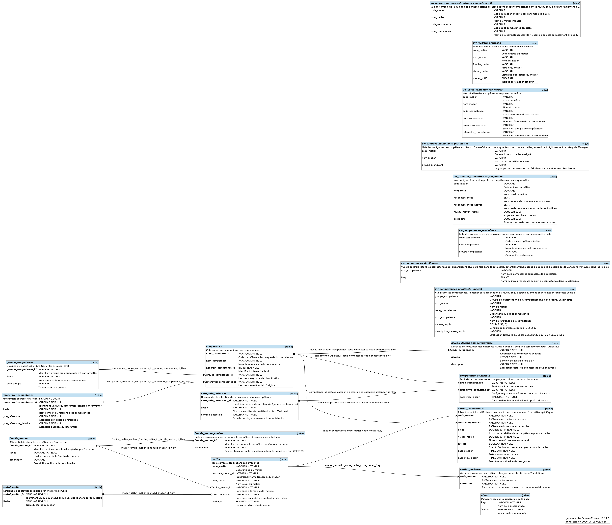

# Déclaration d'utilisation d'IA {.unnumbered}

Conformément aux directives, je déclare avoir utilisé le système **Gemini CLI (modèle de langage)** pour m'assister dans la rédaction de ce rapport. Cet outil a été utilisé pour :
- Structurer le document selon les normes demandées.
- Améliorer la formulation et la clarté de certaines sections techniques.
- Rechercher et synthétiser les informations relatives à la stack technique du projet.

# Résumé {.unnumbered}

[Insérez ici votre résumé en français - 1 page maximum]

# Abstract {.unnumbered}

[Insert your English abstract here - 1 page maximum]

# Remerciements {.unnumbered}

Avant de commencer ce rapport, je tiens à remercier chaleureusement toutes les personnes qui
m’ont permis de réaliser ce stage et qui m’ont accompagné tout au long de cette expérience.

Tout d’abord, j’exprime ma profonde gratitude à **Vinh Faucher**. C’est grâce à lui que ma
candidature a été transmise et qu’il a pu me guider efficacement pour concrétiser son arrivée
au sein de l’OPT-NC.

Je remercie sincèrement mon tuteur de stage, **Adrien Sales** et les membres de la section
GLIA, pour leur accueil, leur confiance et leur temps qu’ils m’ont accordé pour me faire
progresser sur ce sujet technologique très moderne.

Je remercie également **Loïc Salmon** pour la mise à disposition du Jetson Orin Nano, qui a
permis de réaliser les expérimentations autour de l’intelligence artificielle embarquée.

Enfin, je remercie **Jean-Baptiste Raclet** pour sa patience, sa réactivité et l’effort qu’il a
fourni en prenant le temps de consulter et de traiter mes nombreux e-mails concernant les
corrections de fautes de frappe dans ma demande de convention de stage.

# Introduction

Ce rapport présente les travaux réalisés lors de mon stage à l'**OPT-NC**, détaillant la
démarche d'ingénierie, les outils utilisés et les résultats obtenus.

# Contexte, Sujet et Objectifs du Stage

## Contexte et recherches

Dans le cadre de ma première année de Master "Sciences du Logiciel" à l’Université de Toulouse,
la recherche d'un stage s'est avérée être une étape déterminante et parfois complexe. Après
plusieurs démarches infructueuses auprès de diverses entreprises, j'ai dû envisager une
approche plus proactive, menant à une candidature spontanée en Nouvelle-Calédonie. Cette
initiative, bien que non conventionnelle, a été grandement facilitée par **Vinh Faucher**, dont
le soutien a été précieux pour transmettre ma candidature en interne au sein de l'Office des
Postes et Télécommunications de Nouvelle-Calédonie (OPT-NC).

C'est ainsi que j’ai eu l’opportunité d’intégrer la **section GLIA** de l'OPT-NC. Le Génie
Logiciel Inter Applicatif se distingue par son rôle de pôle d'innovation, spécialisé dans le
développement de solutions technologiques avancées, notamment dans les domaines de
l'intelligence artificielle et des services connectés. Mon parcours en Master Sciences du
Logiciel à l'Université de Toulouse, avec ses enseignements solides en ingénierie logicielle,
s'est avéré en parfaite adéquation avec ces orientations technologiques. Cette convergence m'a
permis d'aborder concrètement les défis liés à la structuration des données, au développement
d'APIs performantes et à l'exploitation de l'IA générative, des axes fondamentaux du travail
mené au sein de GLIA. **Adrien Sales**, en tant que mon tuteur, m'a proposé un sujet de stage
qui correspondait parfaitement à mes objectifs académiques et professionnels, marquant le début
d'une expérience enrichissante au sein d'une structure publique résolument tournée vers
l'avenir.

## Sujet du stage

Le sujet qui m’a été confié porte sur l’ingénierie des données et le développement d’une
architecture Cloud Native, des domaines cruciaux pour la modernisation des systèmes
d'information. Au cœur de cette mission se trouve le référentiel métiers de l’OPT-NC, un
annuaire exhaustif des métiers et compétences de l'entreprise. Traditionnellement, ces
informations vitales étaient conservées dans des fichiers tableurs (CSV). Bien que simples
d'utilisation pour des volumes réduits, ces fichiers présentent des limitations significatives
: ils sont intrinsèquement sujets aux erreurs de saisie, rendent l'application de contraintes
d'intégrité complexe, et leur exploitation manuelle devient rapidement laborieuse et source
d'incohérences à mesure que le volume et la complexité des données augmentent. Surtout, leur
nature statique limite fortement leur réutilisation dynamique par d'autres applications, créant
des silos d'information.

Face à ces enjeux, mon travail s'est articulé autour de deux axes majeurs : d'abord,
transformer ce référentiel fragmenté en une base de données relationnelle robuste, structurée
et fiable. Cette transition garantit non seulement l'intégrité et la cohérence des données
grâce à la définition de schémas stricts et de relations claires, mais offre également une
capacité d'interrogation et de gestion beaucoup plus avancée. Ensuite, il était essentiel de
développer un service standardisé (API) permettant à d'autres applications et systèmes
d'accéder à ces données de manière programmatique et automatique. L'adoption d'un protocole
comme **OData** est envisagée pour cette API, apportant des capacités d'interrogation riches et
standardisées, ainsi qu'une description automatique des métadonnées.

Un volet exploratoire ambitieux du projet inclut également l’intégration de l'intelligence
artificielle générative. L'objectif est d'exploiter le protocole MCP (Model Context Protocol)
pour permettre à des agents conversationnels avancés, tels que Gemini ou Claude, d'interagir
directement avec la base de données métiers. Cela ouvre des perspectives inédites pour l'accès
aux informations du référentiel par le langage naturel, démocratisant ainsi l'accès à
l'information pour les utilisateurs non techniques et permettant des analyses plus intuitives
et complexes. Cette approche vise à transformer la manière dont les connaissances sur les
métiers et les compétences sont consultées et valorisées au sein de l'OPT-NC.

## Objectifs

Dans une démarche d’Open Data et d’Open Source, ce projet vise à moderniser les outils de
l’OPT-NC afin de les rendre plus fiables et conformes aux standards actuels de l’industrie.
Pour y parvenir, le travail a été organisé en suivant quatre objectifs principaux :

- Analyser, nettoyer et migrer les fichiers CSV vers une base de données relationnelle (DuckDB)
en appliquant des contraintes d’intégrité fortes.

- Développer une API Java avec le framework **Quarkus**, accompagnée d’une documentation
générée automatiquement via **Redocly**.

- Conteneuriser l’application avec **Podman** et la déployer sur un cluster local **Minikube**
utilisant **Kubernetes**.

- Mettre en place le protocole MCP (Model Context Protocol) afin de permettre à des agents
d’intelligence artificielle comme Gemini ou Claude d’interagir avec le référentiel de données.

# Développement

## Planning du projet

Le déroulement du stage a été structuré autour de plusieurs jalons techniques et de
publication, s'étalant du 11 mai au 18 juin 2026.

\begin{center}
\begin{ganttchart}[
    expand chart=\textwidth,
    title/.style={fill=gray!10, draw=gray!30},
    title label font=\sffamily\bfseries\small,
    canvas/.style={draw=gray!30},
    hgrid/.style={draw=gray!10, line width=.4pt},
    vgrid/.style={draw=gray!20, dotted},
    title height=1,
    y unit title=0.55cm,
    y unit chart=0.7cm,
    bar label font=\sffamily\small,
    bar/.style={fill=cyan!60!blue!60, draw=none, rounded corners=2pt},
    bar height=0.45,
    link/.style={draw=black!45, line width=0.7pt, -latex, on background layer},
    link bulge=0.15
]{1}{6}
  \gantttitle{Mai 2026}{3} \gantttitle{Juin 2026}{3} \\
  \gantttitle{W1}{1} \gantttitle{W2}{1} \gantttitle{W3}{1} \gantttitle{W4}{1} \gantttitle{W5}{1} \gantttitle{W6}{1} \\
  \gantttitle{11/05}{1} \gantttitle{18/05}{1} \gantttitle{25/05}{1} \gantttitle{01/06}{1} \gantttitle{08/06}{1} \gantttitle{15/06}{1} \\
  \ganttbar[name=bar1]{Analyse \& Nettoyage CSV}{1}{2} \\
  \ganttbar[name=bar2]{Modélisation \& DuckDB}{3}{4} \\
  \ganttbar[name=bar3]{Rédaction PDF \& EPUB}{5}{5} \\
  \ganttbar[name=bar4]{Production du site (Hugo)}{6}{6}
  
  \ganttlink{bar1}{bar2}
  \ganttlink{bar2}{bar3}
  \ganttlink{bar3}{bar4}
  % Les jalons précis de ce planning sont les suivants :
  % - Début du stage : 11 Mai 2026 (W1)
  % - Publication DuckDB (Main) : 5 Juin 2026 (W4)
  % - Publication PDF - EPUB (Main) : 11 Juin 2026 (W5)
  % - Publication du site (main) : 18 Juin 2026 (W6)
\end{ganttchart}
\end{center}

## Organisation et environnement de travail

Le travail s’est organisé autour de plusieurs phases successives, allant de la mise en place de l’environnement technique jusqu’à la modélisation complète de la base de données. L'objectif principal était de concevoir un pipeline reproductible et automatisé ("Infrastructure as Code" appliqué à la documentation), éliminant les tâches manuelles et garantissant la cohérence des publications multi-supports (PDF, EPUB, Web).

L’installation de **DuckDB**, le système de gestion de base de données analytique retenu pour ce projet, ainsi que **SchemaCrawler** et **Graphviz**, a permis de poser les bases de la modélisation et de la documentation automatique du schéma physique.

## Ingénierie des données et Modélisation (DuckDB & SQLite)

La première étape de la démarche d’ingénierie a consisté à concevoir une base de données relationnelle robuste à partir des fichiers plats CSV issus de la plateforme RH Neobrain. Pour ce faire, **DuckDB** a été choisi comme moteur principal en raison de sa rapidité, de sa syntaxe SQL moderne et de sa capacité à ingérer directement des fichiers CSV via la fonction `read_csv_auto`.

Le chargement s'effectue via le script [duck.sql](file:///home/onite/IdeaProjects/odata-referentiel-metiers/src/duck.sql) qui réalise les opérations suivantes :
1. **Nettoyage et Normalisation** : Création d'une macro SQL `formatter(str)` permettant de normaliser les identifiants textuels en clés primaires/étrangères propres (passage en minuscules, suppression des accents via `TRANSLATE`, remplacement des caractères spéciaux par des underscores).
2. **Modélisation Relationnelle** : Les tables brutes sont découpées et structurées en un schéma normalisé comprenant les tables `famille_metier`, `metier`, `competence`, `groupe_competence`, `referentiel_competence`, et la table d'association `metier_competence` (qui porte la relation avec le poids et le niveau requis).
3. **Intégration de Verbatims** : Chargement automatique de verbatims métiers réels issus de fichiers CSV stockés dans `data/static/verbatims/`.
4. **Contrôle Qualité de la Donnée** : Conception de plusieurs vues de contrôle et d'audit pour détecter automatiquement les anomalies de saisie avant la génération documentaire :
   * `vw_metiers_orphelins` : Métiers n'ayant aucune compétence associée.
   * `vw_competences_orphelines` : Compétences non requises par les métiers actifs.
   * `vw_groupes_manquants_par_metier` : Identification des métiers manquant d'une catégorie (ex: absence de compétences en Savoir-être).
   * `vw_metiers_qui_possede_niveau_competence_0` : Contrôle des associations dont le niveau requis est anormalement à 0.
   * `vw_competences_dupliquees` : Détection des doublons de compétences.

En parallèle, une base **SQLite3** secondaire ([sqlite.sql](file:///home/onite/IdeaProjects/odata-referentiel-metiers/src/sqlite.sql)) est générée à partir des tables exportées pour assurer une compatibilité maximale avec les clients externes ou des cas d'usage légers.

## Automatisation et Orchestration (Taskfile & uv)

Pour orchestrer ce pipeline complexe de manière déterministe, le projet s’appuie sur **Taskfile** (alternative moderne à Make en YAML). Le fichier [Taskfile.yml](file:///home/onite/IdeaProjects/odata-referentiel-metiers/Taskfile.yml) définit des tâches unitaires chaînées :
* `clean` : Nettoie l'environnement et les dossiers de sortie.
* `duckdb` & `sqlite` : Initialisent et remplissent les bases de données.
* `schema` : Exécute **SchemaCrawler** pour générer les schémas de base de données (PNG, PDF, HTML) et réaliser des audits de qualité (linting).
* `docs` : Lance les scripts de génération et compile les fichiers PDF et EPUB.
* `site` : Construit le portail Hugo.

La reproductibilité logicielle et la vitesse d'exécution sont garanties par **uv**, le gestionnaire d'environnements et de paquets Python. `uv` s'assure que toutes les dépendances définies dans le projet sont installées instantanément dans un environnement virtuel isolé (`.venv`), évitant les conflits de version.

## Pipeline de Génération Documentaire (AsciiDoc & Asciidoctor)

La documentation officielle du référentiel métiers est générée dynamiquement à partir des données nettoyées dans DuckDB. Le script Python [generate-adoc.py](file:///home/onite/IdeaProjects/odata-referentiel-metiers/src/generate-adoc.py) extrait les données relationnelles et rédige le fichier source au format **AsciiDoc** (`referentiel_metiers.adoc`). Ce script implémente des éléments visuels riches :
* Une mise en page de garde dynamique et des métadonnées strictes.
* La traduction des niveaux de compétences (1 à 4) en représentations visuelles (cercles pleins/vides générés par FontAwesome).
* Le regroupement structuré des compétences par catégories (Savoir, Savoir-faire, Savoir-être, Manager).

Une fois le fichier `.adoc` généré, **Asciidoctor PDF** prend le relais pour compiler le document en un rapport PDF de haute qualité, utilisant un thème de mise en page personnalisé (`pdf-theme.yml`). De même, **Pandoc** convertit ce contenu en format **EPUB 3** en y intégrant le style CSS et les polices embarquées.

## Portail Web Interactif (Hugo & Thème Relearn)

Pour rendre le référentiel accessible en ligne de manière interactive, le pipeline génère un portail web statique avec **Hugo**. Le script [generate-md.py](file:///home/onite/IdeaProjects/odata-referentiel-metiers/src/generate-md.py) génère l'arborescence des fichiers Markdown structurés (fiches métiers, familles, compétences) à partir de la base de données.

Le site utilise le thème moderne **Relearn** et intègre :
* Une configuration dynamique (`hugo.dynamic.toml`) pour la gestion des logos et de l'URL de base.
* Deux thèmes de couleurs personnalisés aux couleurs de l'OPT-NC (`theme-opt-light-theme.css` et `theme-opt-dark-theme.css`).
* Des icônes Font Awesome pour le menu de navigation.
* Un pied de page dynamique intégrant le tag de versioning Git récupéré automatiquement lors du build de production (`release_version.json`).

# Résultats obtenus

Le processus d'ingénierie des données et de développement a abouti à plusieurs résultats
tangibles, notamment la transformation du référentiel métiers et la génération automatique de
sa documentation.

Le schéma conceptuel et physique de la base de données DuckDB, généré à partir de l'analyse du
référentiel, est présenté ci-dessous. Il illustre la structure des données et les relations
entre les différentes entités métiers et compétences.

[Continuer à détailler ici les résultats obtenus : livrables, bases de données fonctionnelles,
outils de documentation générés, etc. - pour atteindre les 2 pages environ]

# Bilan pour l'entreprise et liens avec la formation

[Expliquez l'apport de votre travail pour l'OPT-NC et comment les enseignements de votre Master
Sciences du Logiciel ont été mobilisés - 1 page]

# Bilan des connaissances et des compétences

[Présentez ici les compétences acquises ou renforcées (savoir-faire et savoir-être) sous forme
de verbes d'action - 3 pages]

# Objectifs pour la suite en M2

[Précisez ici vos objectifs pour l'année de Master 2 : poursuite à l'OPT-NC ou autre type de
structure/mission visée - 1 page]

# Conclusion

Mon stage au sein de l'OPT-NC a été une expérience enrichissante qui m'a permis de renforcer
mes compétences
techniques en Python et en ingénierie logicielle, tout en découvrant les enjeux d'un secteur à
la pointe de l'innovation.

# Annexes {.unnumbered}

## Stack technique

Le projet s’appuie sur une stack technologique moderne axée sur la manipulation de données,
l’automatisation et la génération de documentation multi-supports. Les outils principaux
utilisés sont :

*   **DuckDB (v1.5.3+)** : Moteur de base de données analytique principal pour charger les
    fichiers CSV sources et structurer le référentiel.
*   **SQLite3** : Base de données secondaire pour assurer la compatibilité.
*   **Python (v3.14.5+)** : Langage de programmation pour les scripts de transformation de
    données et de génération de contenu (`generate-adoc.py`, `generate-md.py`).
*   **SchemaCrawler (v17.11.1+)** : Outil pour générer automatiquement des schémas de base de
    données (PDF, PNG, HTML) et réaliser des audits de qualité.
*   **Graphviz** : Moteur de rendu utilisé par SchemaCrawler pour la visualisation des diagrammes.
*   **Asciidoctor PDF (v2.3.15+)** : Pour convertir les fichiers AsciiDoc en documentation PDF
    formatée.
*   **Pandoc (v3.9.0.2+)** : Pour la conversion du contenu vers le format EPUB.
*   **Hugo (v0.163.0+)** : Générateur de site statique pour le portail web du référentiel métiers, avec le thème **Relearn**.
*   **Taskfile (v3.50.0+)** : Alternative aux Makefile pour orchestrer le pipeline (nettoyage,
    build des bases, génération des docs et du site).
*   **uv (v0.11.15+)** : Gestionnaire de paquets et d’environnements Python rapide, assurant la reproductibilité.

## Glossaire

**OPT-NC (Office des Postes et Télécommunications de Nouvelle-Calédonie)**
: Établissement public à caractère industriel et commercial fournissant des services postaux et
de télécommunications en Nouvelle-Calédonie.

**GLIA**
: Section au sein de l'OPT-NC spécialisée dans le développement de solutions technologiques
avancées, notamment en intelligence artificielle.

**CSV (Comma Separated Values)**
: Format de fichier texte simple pour stocker des données tabulaires, où les valeurs sont
séparées par des virgules.

**DuckDB**
: Système de gestion de base de données analytique embarqué, optimisé pour les requêtes OLAP
directement sur des fichiers de données.

**API (Application Programming Interface)**
: Ensemble de définitions et de protocoles utilisés pour créer et intégrer des logiciels
d'application. Elle permet à différents systèmes de communiquer entre eux.

**Asciidoctor PDF**
: Outil permettant de convertir des documents AsciiDoc en fichiers PDF formatés, souvent
utilisé pour la documentation technique.

**Cloud Native**
: Approche de construction et d'exécution d'applications qui tire parti des avantages du cloud
computing, notamment l'élasticité, la résilience et la scalabilité.

**Graphviz**
: Logiciel de visualisation de graphes utilisé pour représenter des structures et des relations
sous forme graphique.

**Hugo**
: Générateur de sites statiques rapide, utilisé pour créer des sites web performants à partir
de fichiers Markdown.

**MCP (Model Context Protocol)**
: Protocole permettant à des modèles d'IA générative d'interagir et d'interroger des bases de
données structurées.

**OData (Open Data Protocol)**
: Protocole basé sur HTTP, Atom et JSON, pour construire et consommer des API RESTful
permettant d'interroger et de manipuler des données.

**Pandoc**
: Convertisseur universel de documents, capable de transformer des fichiers d'un format de
balisage à un autre (par exemple, Markdown vers EPUB).

**Python**
: Langage de programmation interprété, de haut niveau, souvent utilisé pour l'analyse de
données, le scripting et le développement web.

**Référentiel métiers**
: Annuaire ou base de données structurée détaillant les métiers, rôles, compétences et autres
informations liées aux ressources humaines d'une organisation.

**SchemaCrawler**
: Outil d'analyse et de documentation de schémas de bases de données, capable de générer des
rapports et des visualisations.

**Stack technique**
: Ensemble des technologies et outils logiciels utilisés pour développer et déployer une
application ou un système.

**Taskfile**
: Outil d'automatisation de tâches basé sur YAML, servant d'alternative moderne aux Makefiles.

**uv**
: Outil rapide de gestion de paquets et d'environnements pour Python, optimisé pour
l'installation rapide de dépendances.
